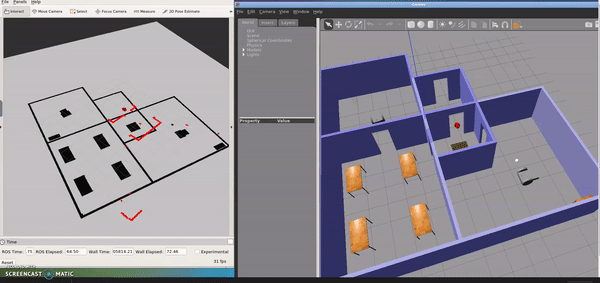

# Where Am I
In this project the goal was to implement Adaptive Monte Carlo Localization (AMCL) package based robot localization within ROS framework.

--- 
## Directory Structure
### my_robot

* [my_robot/](./src/my_robot)
  * [config/](./src/my_robot/config)
    * [base_local_planner_params.yaml](./src/my_robot/config/base_local_planner_params.yaml)
    * [costmap_common_params.yaml](./src/my_robot/config/costmap_common_params.yaml)
    * [global_costmap_params.yaml](./src/my_robot/config/global_costmap_params.yaml)
    * [local_costmap_params.yaml](./src/my_robot/config/local_costmap_params.yaml)
  * [launch/](./src/my_robot/launch)
    * [amcl.launch](./src/my_robot/launch/amcl.launch)
    * [robot_description.launch](./src/my_robot/launch/robot_description.launch)
    * [world.launch](./src/my_robot/launch/world.launch)
  * [maps/](./src/my_robot/maps)
    * [myroboworldmap.pgm](./src/my_robot/maps/myroboworldmap.pgm)
    * [myroboworldmap.yaml](./src/my_robot/maps/myroboworldmap.yaml)
  * [meshes/](./src/my_robot/meshes)
    * [hokuyo.dae](./src/my_robot/meshes/hokuyo.dae)
  * [rviz/](./src/my_robot/rviz)
    * [localization.rviz](./src/my_robot/rviz/localization.rviz)
  * [urdf/](./src/my_robot/urdf)
    * [my_robot.gazebo](./src/my_robot/urdf/my_robot.gazebo)
    * [my_robot.xacro](./src/my_robot/urdf/my_robot.xacro)
  * [worlds/](./src/my_robot/worlds)
    * [myroboworld.world](./src/my_robot/worlds/myroboworld.world)
  * [CMakeLists.txt](./src/my_robot/CMakeLists.txt)
  * [package.xml](./src/my_robot/package.xml)
* [CMakeLists.txt](./src/CMakeLists.txt)

--- 
## Project Description

In this project, I used the previous project  `ball-chaser-ws`:  
1. In package `my_robot`:  
	- I created the map f`my_robot`rom world using `pgm-map-creator` .

	- Tested out the map server to check if the map generated similar to the world.

2. AMCL Integeration:  
AMCL has to be integerated into `my_robot` package
    - I created the launch file [amcl.launch](./src/my_robot/launch/amcl.launch) which contains creating the node of AMCL with the required parameters.

	- I included the new created lanuch file into [world.launch](./src/my_robot/launch/world.launch).

3. Test the localization:  
	- I used  tele-operated node to navigate the robot through the map and watch 
	  the algorithm locating the robot correctly.

	- Also i noted when i do more navigation in small areas in the map , the robot   will localize itself more quickly.

	- If I leave the initial position quickly without navigating through it, the robot will not localize itself correctly but when the robot returns to the start point then it will localize the position accurately.

--- 
## Dependencies for Running Locally
* cmake >= 2.8
  * All OSes: [click here for installation instructions](https://cmake.org/install/)
* make >= 4.1 (Linux, Mac), 3.81 (Windows)
  * Linux: make is installed by default on most Linux distros
  * Mac: [install Xcode command line tools to get make](https://developer.apple.com/xcode/features/)
  * Windows: [Click here for installation instructions](http://gnuwin32.sourceforge.net/packages/make.htm)
* gcc/g++ >= 5.4
  * Linux: gcc / g++ is installed by default on most Linux distros
  * Mac: same deal as make - [install Xcode command line tools](https://developer.apple.com/xcode/features/)
  * Windows: recommend using [MinGW](http://www.mingw.org/)
* ROS  >= (Kinetic/Melodic/Noetic)
  * For all platform and OS [Click here for installation instructions](http://wiki.ros.org/ROS/Installation)

--- 
## Basic Build Instructions

1. Clone this repo.
2. Inside cloned folder `catkin_make`
3. Then source the workspace: `source devel/setup.bash`
4. Then run the launch files: `roslaunch my_robot world.launch`
--- 
### Useful Resources

* AMCL package: [http://wiki.ros.org/amcl](http://wiki.ros.org/amcl)
* pgm-map-creator: [https://github.com/udacity/pgm_map_creator](https://github.com/udacity/pgm_map_creator)
